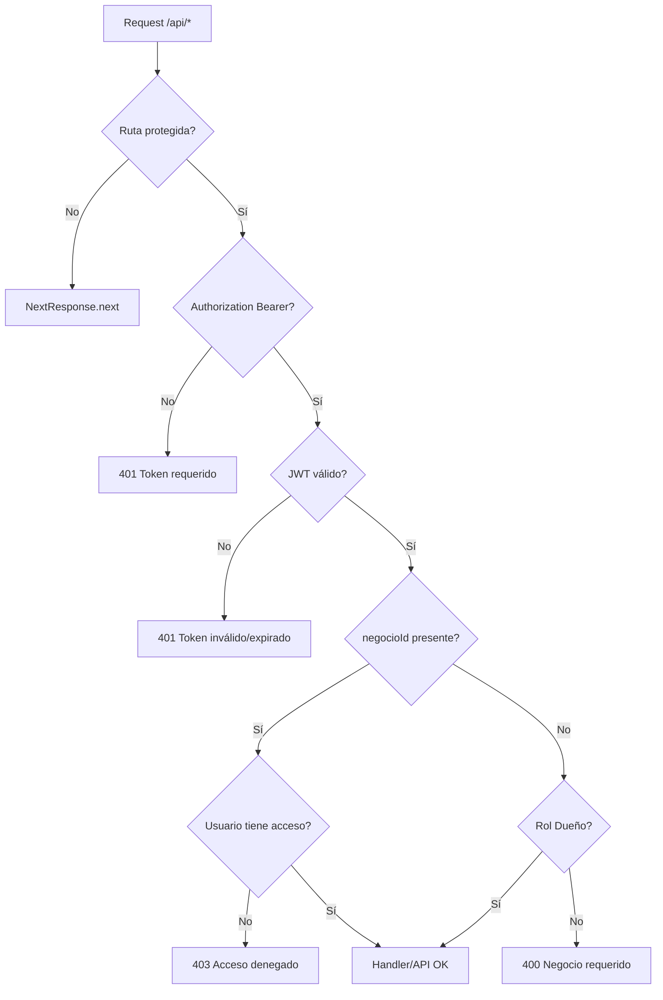

# Ground Truth — Sprint 1.1 (Fase 1.1 → Transición a 1.2.x)

**Proyecto:** ONEBUSINESS  
**Sprint:** 1.1 (tareas 1.1.1 a 1.1.8)  
**Última actualización:** 2026-03-12  
**Propósito:** Single Source of Truth del estado real del Sprint 1.1, con evidencias verificables, decisiones técnicas y dependencias para iniciar la fase 1.2.x.

---

## 1) Audiencia y alcance

**Audiencia**
- Product Owner: validación de entregables y criterios de aceptación.
- Equipo técnico (Backend/Frontend/DB/QA): referencia única de implementación, calidad y riesgos.
- Stakeholders: resumen de capacidades alcanzadas y readiness para 1.2.x.

**Alcance**
- Incluye: configuración del proyecto, schema/migraciones, auth JWT, middleware de auth, multi-tenancy, seed inicial, página de login, suite de tests y coverage.
- Excluye: features de Sprint 1.2.x (solo se documentan dependencias y readiness).

---

## 2) Entregables del Sprint 1.1 (definición precisa)

### 2.1 Entregables por tarea

**1.1.1 Configuración inicial del proyecto**
- Next.js 14 con App Router, TypeScript strict, Tailwind, estructura de carpetas base.
- Lint/Build operativos.
- Archivos clave:
  - [package.json](file:///c:/Users/nadir/SergioMadrid/onebusiness/package.json)
  - [tsconfig.json](file:///c:/Users/nadir/SergioMadrid/onebusiness/tsconfig.json)
  - [tailwind.config.ts](file:///c:/Users/nadir/SergioMadrid/onebusiness/tailwind.config.ts)
  - [src/app/layout.tsx](file:///c:/Users/nadir/SergioMadrid/onebusiness/src/app/layout.tsx)
  - [src/app/globals.css](file:///c:/Users/nadir/SergioMadrid/onebusiness/src/app/globals.css)

**1.1.2 Schema DB + migraciones (Drizzle)**
- Tablas: `negocios`, `centros_costo`, `roles`, `usuarios`, `usuario_negocio`.
- Índices: `idx_centros_costo_negocio_id`, `idx_usuario_negocio_usuario_id`, `idx_usuario_negocio_negocio_id`.
- Migración inicial generada y aplicada.
- Archivos clave:
  - [drizzle.ts](file:///c:/Users/nadir/SergioMadrid/onebusiness/src/lib/drizzle.ts)
  - [db.ts](file:///c:/Users/nadir/SergioMadrid/onebusiness/src/lib/db.ts)
  - [0001_init.sql](file:///c:/Users/nadir/SergioMadrid/onebusiness/drizzle/migrations/0001_init.sql)
  - [drizzle.config.ts](file:///c:/Users/nadir/SergioMadrid/onebusiness/drizzle.config.ts)

**1.1.3 Autenticación JWT (access + refresh)**
- Utilidades JWT (generate/verify) + hashing bcrypt.
- Endpoints:
  - POST `/api/auth/login`
  - POST `/api/auth/refresh`
  - POST `/api/auth/logout`
- Archivos clave:
  - [jwt.ts](file:///c:/Users/nadir/SergioMadrid/onebusiness/src/lib/jwt.ts)
  - [auth.service.ts](file:///c:/Users/nadir/SergioMadrid/onebusiness/src/services/auth.service.ts)
  - [login route](file:///c:/Users/nadir/SergioMadrid/onebusiness/src/app/api/auth/login/route.ts)
  - [refresh route](file:///c:/Users/nadir/SergioMadrid/onebusiness/src/app/api/auth/refresh/route.ts)
  - [logout route](file:///c:/Users/nadir/SergioMadrid/onebusiness/src/app/api/auth/logout/route.ts)
  - [auth.types.ts](file:///c:/Users/nadir/SergioMadrid/onebusiness/src/types/auth.types.ts)

**1.1.4 Middleware de autenticación**
- Extracción Bearer token.
- Validación JWT + mapeo a `AuthResult`.
- Rutas protegidas definidas (whitelist/blacklist).
- Archivos clave:
  - [auth-middleware.ts](file:///c:/Users/nadir/SergioMadrid/onebusiness/src/middleware/auth-middleware.ts)
  - [middleware/index.ts](file:///c:/Users/nadir/SergioMadrid/onebusiness/src/middleware/index.ts)
  - [middleware.ts (Next)](file:///c:/Users/nadir/SergioMadrid/onebusiness/src/middleware.ts)

**1.1.5 Middleware de multi-tenancy**
- Extracción de `negocioId` por `X-Negocio-Id` o `?negocioId=`.
- Validación de acceso por rol:
  - `Dueño`: puede omitir `negocioId` (acceso global).
  - Otros roles: `negocioId` requerido (400 si falta) + 403 si no está asignado.
- Helper de filtros Drizzle por `negocio_id`.
- Archivos clave:
  - [tenant-middleware.ts](file:///c:/Users/nadir/SergioMadrid/onebusiness/src/middleware/tenant-middleware.ts)
  - [tenant.types.ts](file:///c:/Users/nadir/SergioMadrid/onebusiness/src/types/tenant.types.ts)
  - [base.service.ts](file:///c:/Users/nadir/SergioMadrid/onebusiness/src/services/base.service.ts)

**1.1.6 Seed de datos iniciales**
- Seed idempotente con:
  - 10 negocios (IDs fijos 1..10).
  - 4 roles.
  - 13 centros de costo (negocios 1..4).
  - 4 usuarios de prueba + asignaciones.
- Script para crear DB si no existe (`db:create`) y verificación de conteos.
- Archivos clave:
  - [seed.ts](file:///c:/Users/nadir/SergioMadrid/onebusiness/src/lib/seed.ts)
  - [create-db.ts](file:///c:/Users/nadir/SergioMadrid/onebusiness/src/lib/create-db.ts)
  - [verify-db.ts](file:///c:/Users/nadir/SergioMadrid/onebusiness/src/lib/verify-db.ts)
  - [README.md](file:///c:/Users/nadir/SergioMadrid/onebusiness/README.md)

**1.1.7 Página de login**
- UI Login con validación (zod + react-hook-form), estados de loading/error.
- Tokens en localStorage (no cookies).
- Contexto `AuthProvider` + hook `useAuth`.
- Cliente API con refresh automático ante 401.
- Archivos clave:
  - [login page](file:///c:/Users/nadir/SergioMadrid/onebusiness/src/app/%28auth%29/login/page.tsx)
  - [auth layout](file:///c:/Users/nadir/SergioMadrid/onebusiness/src/app/%28auth%29/layout.tsx)
  - [login-form.tsx](file:///c:/Users/nadir/SergioMadrid/onebusiness/src/components/auth/login-form.tsx)
  - [auth-context.tsx](file:///c:/Users/nadir/SergioMadrid/onebusiness/src/contexts/auth-context.tsx)
  - [use-auth.ts](file:///c:/Users/nadir/SergioMadrid/onebusiness/src/hooks/use-auth.ts)
  - [api-client.ts](file:///c:/Users/nadir/SergioMadrid/onebusiness/src/lib/api-client.ts)

**1.1.8 Suite de tests Sprint 1.1**
- Vitest + coverage (v8).
- Unit tests: jwt, auth-middleware, tenant-middleware, auth.service.
- Integration tests: handlers de auth, multi-tenancy y flujo login básico.
- Archivos clave:
  - [vitest.config.ts](file:///c:/Users/nadir/SergioMadrid/onebusiness/vitest.config.ts)
  - [tests/unit](file:///c:/Users/nadir/SergioMadrid/onebusiness/tests/unit)
  - [tests/integration](file:///c:/Users/nadir/SergioMadrid/onebusiness/tests/integration)

---

## 3) Criterios de aceptación (verificados)

### 3.1 Evidencias (comandos y resultados)

**Build & Lint**
- `npm run lint` ✅ sin errores.
- `npm run build` ✅ compila exitosamente.

**DB**
- `npm run db:create` ✅ crea `onebusiness` cuando no existe.
- `npm run db:migrate` ✅ aplica migraciones Drizzle.
- `npm run db:seed` ✅ seed completo.
- Conteos verificados (script local):  
  - negocios: 10  
  - roles: 4  
  - usuarios: 4  
  - centros_costo: 13  
  - usuario_negocio: 16

**Auth & Login**
- POST `/api/auth/login` ✅ retorna accessToken + refreshToken + user.
- UI `/login` ✅ renderiza, valida email, maneja errores, y redirige a `/dashboard` en éxito.

**Multi-tenancy**
- No Dueño sin `negocioId` → 400 ✅
- No Dueño sin acceso al negocio → 403 ✅
- Dueño puede omitir `negocioId` → permitido ✅

**Tests**
- `npm test` ✅ (Vitest) todos los tests pasan.
- `npm run test:coverage` ✅ coverage ≥ 80% en archivos críticos.

---

## 4) Métricas de calidad alcanzadas

### 4.1 Umbrales mínimos del sprint (objetivo vs. logrado)

| Área | Objetivo Sprint 1.1 | Resultado |
|------|----------------------|----------|
| Lint | 0 errores | ✅ 0 errores |
| Build | 0 errores | ✅ 0 errores |
| Tests | `npm test` sin errores | ✅ 52 tests OK |
| Coverage global (archivos críticos) | ≥ 80% | ✅ ~98% statements / ~96% branches |
| JWT utils | 100% funciones | ✅ 100% funciones |
| tenant-middleware | ≥ 90% | ✅ 100% |
| auth-middleware | ≥ 90% | ✅ 100% |
| auth.service | ≥ 85% | ✅ 100% |

---

## 5) Decisiones técnicas (registradas)

### 5.1 Arquitectura y plataforma
- Next.js 14 App Router (API Routes en `src/app/api/*`).
- TypeScript strict mode (sin `any` en lógica core).

### 5.2 Autenticación
- JWT con `jose` (access token + refresh token).
- Almacenamiento en **localStorage** (NO cookies).
- Refresh automático en cliente cuando el API responde 401 (ver [api-client.ts](file:///c:/Users/nadir/SergioMadrid/onebusiness/src/lib/api-client.ts)).

### 5.3 Multi-tenancy
- Contexto de tenant por request con `X-Negocio-Id` o `negocioId` query.
- Política “fail secure”: si no hay `negocioId` y el rol no es Dueño → denegar (400).
- Helper `tenantWhere/tenantAnd` para estandarizar filtros en servicios (Drizzle).

### 5.4 Datos y migraciones
- Drizzle ORM + drizzle-kit.
- Migración inicial SQL versionada en `drizzle/migrations`.
- Seed determinista e idempotente para desarrollo.
- Script `db:create` para crear la DB cuando no existe (reduce fricción en onboarding).

### 5.5 Testing
- Vitest + cobertura v8.
- Tests de integración a nivel handler (sin levantar servidor) para estabilidad y velocidad.

---

## 6) Lecciones aprendidas (Sprint 1.1)

### 6.1 Operativas
- La ausencia de DB creada es un bloqueo común: `db:create` reduce el tiempo de arranque del equipo.
- Herramientas del sistema (ej. `psql`) pueden no estar en PATH; el proyecto debe ser usable con scripts propios.

### 6.2 Técnicas
- Validaciones zod deben alinearse con mensajes y códigos esperados (400 vs 401).
- Tests de integración basados en handlers detectan regresiones de contrato sin costo de infraestructura.
- Multi-tenancy debe validarse en middleware y también en handlers críticos (defensa en profundidad).

---

## 7) Dependencias críticas y readiness para Sprint 1.2.x

### 7.1 Dependencias establecidas en Sprint 1.1 (ya resueltas)
- DB accesible vía `DATABASE_URL` y migraciones aplicadas.
- Usuarios de prueba y roles disponibles via seed.
- Auth endpoints operativos.
- Middlewares de auth y tenant funcionando.
- Suite de tests y coverage configurados.

### 7.2 Requisitos de entrada para 1.2.x (must-have)
- `.env` válido para entorno del equipo (DB + JWT).
- `npm run db:migrate` y `npm run db:seed` ejecutables sin intervención manual.
- `npm test` y `npm run test:coverage` como gate de calidad.

---

## 8) Diagramas (Mermaid)

### 8.1 Flujo Auth + Tenant (API protegida)

---

## 9) Aprobación y control de cambios

### 9.1 Checklist de aprobación técnica (Equipo)
- [ ] Revisar coherencia de entregables vs. prompts 1.1.1–1.1.8.
- [ ] Ejecutar `npm run lint` y `npm run build`.
- [ ] Ejecutar `npm run db:create && npm run db:migrate && npm run db:seed`.
- [ ] Ejecutar `npm test` y `npm run test:coverage`.
- [ ] Verificar login UI en `/login` con credenciales de seed.
- [ ] Confirmar políticas de tenant (400/403) por rol.

### 9.2 Checklist de aprobación de producto (PO)
- [ ] Login funciona con usuarios de prueba.
- [ ] Roles existen y se reflejan en el payload JWT.
- [ ] Aislamiento por negocio (no Dueño) funciona (bloqueos correctos).
- [ ] Evidencias (tests/coverage) aceptadas como gate.

### 9.3 Firmas

| Rol | Nombre | Fecha | Aprobación |
|-----|--------|-------|------------|
| Tech Lead |  |  |  |
| Backend |  |  |  |
| Frontend |  |  |  |
| QA |  |  |  |
| Product Owner |  |  |  |

